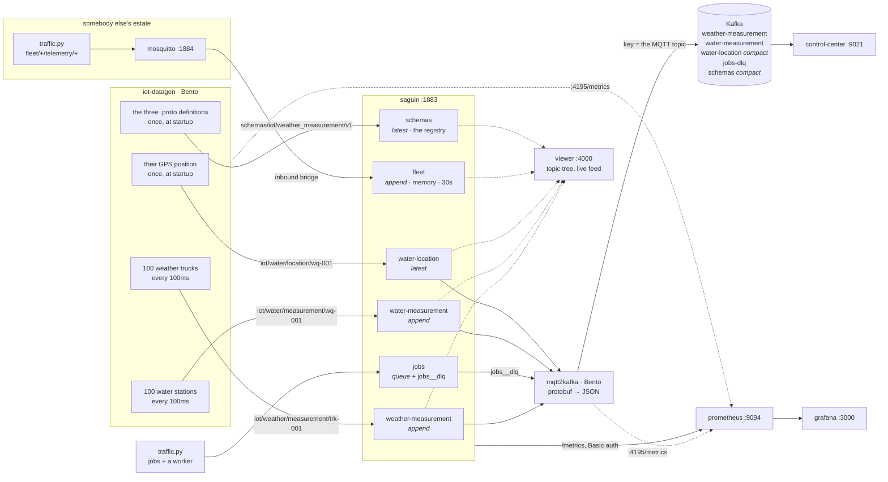
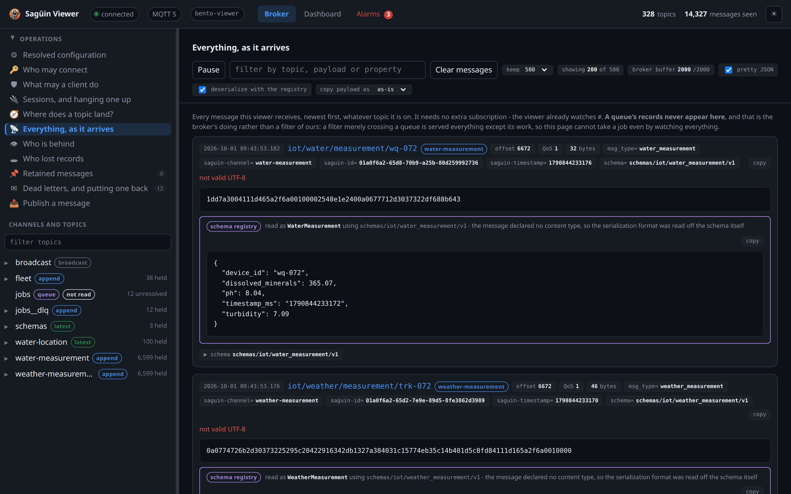
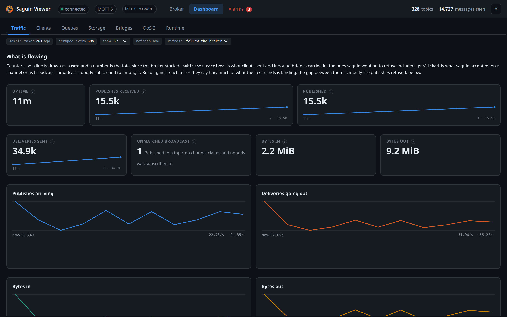

# Bento connectors

Two [Bento](https://warpstreamlabs.github.io/bento/) pipelines, a Sagüin to
run them against, and the containers to hold the lot:

| | |
|---|---|
| `IoTDataGen.yaml` | invents 200 sensors - 100 weather trucks and 100 water-quality stations - and publishes their readings to Sagüin as fixed-size binary |
| `MQTT2Kafka.yaml` | subscribes to those readings, turns each one back into JSON, and produces it to Kafka with the device in the key |

One `docker compose up --build` starts the broker, a single-node Confluent
Platform Kafka and both pipelines, and about a minute later records are
landing in Kafka. Nothing needs installing: every binary is built or pulled
into an image.

**And three windows onto it**, one per half and one on the broker between:

| | |
|---|---|
| **The viewer**, <http://localhost:4000> | the MQTT side: every topic as a tree, a live feed of everything arriving, a publish form, a channel replay, and a dashboard of Sagüin's own numbers. It is [saguin-viewer](https://github.com/ifnesi/saguin-viewer), a repository of its own, pointed at this stack |
| **Control Center**, <http://localhost:9021> | the Kafka side: topics, and the JSON that arrived in them |
| **Grafana**, <http://localhost:3000> | Sagüin itself - every metric it emits, drawn against this load. No login |

## What is talking to what

Two brokers, and they are not two of the same thing: **Sagüin** is what
everything here uses, and **mosquitto** is somebody else's estate that
Sagüin's *bridge* reads from. Every topic here is
`iot/<domain>/<kind>/<device>`, and which Sagüin channel claims it is
decided by that channel's topic filter rather than by any level of the
topic being its name.



Solid lines carry records; dotted lines are somebody looking. The viewer
subscribes to `#` and is served the `append` and `latest` channels and every
topic no channel claims - and *not* `jobs`. That last part is the broker's
doing rather than the viewer's restraint: a filter merely crossing a queue is
granted and served everything except its work, so a queue gives each job to
one worker even when somebody is watching everything.

**The readings are deserialized on `:4000`.** This stack sends protobuf,
and the viewer reads it through Sagüin's own schema registry - the schema
comes from the broker at the moment of asking, so the image knows nothing
about this stack. The bytes stay on screen with the deserialized record
beside them, because the bytes are the record and the card is an
interpretation of them. The topics, the message properties, the offsets
and the channel each record landed in are all there too, and Control
Center shows the deserialized form on the Kafka side.






The dashboard is the reason the pipelines are worth having here rather than
in an example of their own. A generator written to make a dashboard look
busy is the weakest evidence that its numbers mean anything; two hundred
simulated devices being moved through Sagüin's channels into Kafka is a load
nobody shaped, and it is the case the metric catalogue was designed for.

## The four channels

The readings do not land in ordinary MQTT broadcast. **Each channel carries
an MQTT topic filter**, and that is what claims them:

| Topic | Channel | Type |
|---|---|---|
| `iot/weather/measurement/trk-001` | `weather-measurement` | `append` |
| `iot/water/measurement/wq-001` | `water-measurement` | `append` |
| `iot/water/location/wq-001` | `water-location` | `latest` |
| `schemas/iot/weather_measurement/v1` | `schemas` | `latest` |

The layout is `iot/<domain>/<kind>/<device>`, which is what a standard MQTT
fleet already looks like: one `iot/` root, `iot/water/` holding both an
append channel and a latest one, told apart by the third level. **This is
why a channel claims by filter rather than by name** - a name is one topic
level and always the first, so three families wanting three channel types
would need three different first levels, and `weather` and `water` could
not share a root at all.

None of the three `iot/` filters ends in `#`, so each matches exactly four
levels. `iot/weather/measurement/trk-001/raw` is five and belongs to nobody,
which makes it ordinary broadcast: delivered live and stored nowhere.
`saguin --route <config> <topic>` says where any topic lands without
publishing to it. `saguin.yaml` is where they are configured, one block
each.

**What the two `append` channels buy** is a bridge that keeps its place. It
connects with a fixed client id, `clean_start: false` and a session expiry,
which makes it a durable consumer: Sagüin stores the offset it has
acknowledged up to, per channel. Stop the bridge, leave the generator
running, start it again, and the records published in between are delivered
from Sagüin's log rather than being gone.

That is a claim to check rather than believe. Stop the bridge, wait, start
it, and ask Kafka how many of the records it eventually produced were taken
while it was not running:

```sh
docker compose stop mqtt2kafka
sleep 30                          # the generator keeps publishing into saguin
docker compose start mqtt2kafka

# Then read the whole topic back and count the records whose reading was
# taken inside that window. `--max-messages` is doing real work here: the
# generator never stops, so a console consumer with only `--timeout-ms`
# never reaches the end and never prints anything at all.
docker compose exec kafka kafka-get-offsets \
  --bootstrap-server kafka:29092 --topic weather-measurement
docker compose exec kafka kafka-console-consumer \
  --bootstrap-server kafka:29092 --topic weather-measurement \
  --from-beginning --max-messages <that offset>
```

```
300 of 7436 records were read while the bridge was down (30s)
first: {"device_id":"trk-071", "timestamp_ms":"1787648910410", "temperature":30.04, "humidity":63.04, "latitude":-32.705481, "longitude":-133.310113}
last:  {"device_id":"trk-070", "timestamp_ms":"1787648940310", "temperature":18.12, "humidity":61.06, "latitude":8.999272, "longitude":-135.15235}
```

Every reading the generator took during the outage is there, from 37ms after
the bridge stopped to 70ms before it came back. A bridge with no stored
position produces none of them.

**What the `latest` channel buys** is that startup order stops mattering.
Each water station publishes its GPS position exactly once, at startup, and
never again. A plain broker would make that fragile: if the generator
started before the bridge had subscribed, those 100 messages would go into
an empty room and the `water-location` Kafka topic would never be created
at all, so the compose file would have to hold the generator back until the
bridge reported itself healthy. A `latest` channel keeps the current value
of every topic it holds, and hands the lot to whoever subscribes next. The
generator depends only on the broker.

You can see that from outside the stack. Subscribe long after those messages
were sent - the stack below had been up for minutes - and all 100 arrive,
carrying the RETAIN flag, because they are current state rather than a
replay:

```sh
# `%r` is the RETAIN flag. mosquitto_sub 2.0.22; `-V 5` selects MQTT 5.
# Without it you connect as 3.1.1, which saguin accepts - you simply see
# nothing carried beside the payload, offsets and the schema pointer included.
mosquitto_sub -V 5 -h 127.0.0.1 -t 'iot/water/location/+' -W 5 -F '%t %r %l'
```

```
iot/water/location/wq-002 1 35
iot/water/location/wq-004 1 35
iot/water/location/wq-003 1 35
```

One line per station, a hundred of them, every one flagged retained.

## Why Bento is built here rather than pulled

Bento's own `mqtt` input and output speak **MQTT 3.1.1**, and Sagüin
accepts that, so the connection is not the problem.

**What a 3.1.1 client cannot have is everything carried beside the payload.**
No user properties means no `msg_type`, no `schema` pointer, no broker offset
and no broker timestamp; no Response Topic means no point read, so a consumer
could not resolve a schema even if one were named. This stack is a
demonstration of exactly those things, so it wants MQTT 5 end to end and the
older components cannot give it.

The `mqtt_v5` input and output that this stack uses instead are
[warpstreamlabs/bento#991](https://github.com/warpstreamlabs/bento/pull/991),
**merged, but in no release yet**. Until a release carries them there is no
published Bento image with them, so `Dockerfile` builds one from Bento's
`main` - pinned to the merge commit rather than to the branch tip, so that
what this demo demonstrates does not change under it. The day a release
lands, that stage goes and `docker-compose.yml` goes back to
`image: ghcr.io/warpstreamlabs/bento:…`.

What the binary reports is what was built:

```
$ docker compose exec mqtt2kafka bento --version
Version: 1.21.2+mqtt-v5.7fae30c
Date: 2026-09-13T12:40:29+03:00
```

The date is the pinned commit's rather than the moment of the build, so two
people building this get the same answer.

**The one thing MQTT 5 changes in these pipelines**, beyond being accepted
at all, is that a message can carry named properties beside its payload. The
generator sets `msg_type` as ordinary Bento metadata; the `mqtt_v5` output
sends every metadata field as an MQTT 5 user property, and the `mqtt_v5`
input on the other side adds each one back as metadata under its own name.
So the bridge picks its protobuf message from what the publisher *said*
rather than by matching a substring of the topic and trusting the naming
convention held. Under 3.1.1 there is nowhere to put that.

The same field carries `schema`, which names the topic in the `schemas`
channel holding that message's definition - so a consumer can fetch the
`.proto` from the broker rather than being shipped it. "Where the schemas
live" is that mechanism.

## Layout

```
docker-compose.yml           the containers
Dockerfile                   two images built here: Bento, traffic
                             the viewer is built from saguin-viewer, its
                             own repository, from its own
saguin.yaml                  the broker: six channels, a bridge, two providers
operations.passwd            two demonstration credentials: `prometheus` reaches
                             /metrics, `operator` reaches the /v1 routes as well

IoTDataGen.yaml              generator pipeline
lib/gauss.blobl                shared noise helper
templates/                     one mapping per message kind
  weather_measurement.blobl
  water_measurement.blobl
  water_location_startup.blobl
  schema_registry_startup.blobl  the .proto, split and published

MQTT2Kafka.yaml              bridge pipeline

schema/iot.proto             the wire format, used by both

prometheus.yml               one scrape job, with the credential
grafana/provisioning/        the datasource, and where the dashboard comes from
grafana/dashboards/saguin.json   the dashboard, as code
traffic.py                   the queue, the bridge and the mistakes
                             the viewer is saguin-viewer, a repository
                             of its own, not a page written for this
                             stack
mosquitto/mosquitto.conf     the bridge's upstream
vol/config/                  Control Center's own Prometheus and Alertmanager
```

Both pipelines read their mappings and schema by **relative path**, and
Bento resolves those from its working directory rather than from the
config file. Run them from this directory, or the compose file, which sets
the working directory for you.

## Run it

```sh
cd examples/bento-connectors
docker compose up --build
```

**Run this demo or the home-automation one, not both at once.** Both publish
`1883`, because both want the port an MQTT client reaches without being told.
Stop the other first with `docker compose down` in its directory. Brought up
on top of each other, the second does not refuse cleanly: its broker starts
*healthy with no published ports*, and `localhost:1883` keeps answering -
from the first demo's broker. Everything then measures the wrong one.

**Sagüin and [the viewer](https://github.com/ifnesi/saguin-viewer) are their
published images**, `ghcr.io/ifnesi/saguin` and `ghcr.io/ifnesi/saguin-viewer`.
**The first run builds two and takes a few minutes**: the traffic generator
from this checkout, and Bento from its `main`, which has no published image
with `mqtt_v5`. After that they are cached.

### Is it actually doing anything?

```sh
make smoke        # from the repository root
```

**Every container can be healthy over a demo that is doing nothing**, and
neither `docker compose ps`, `bento lint` nor the dashboard would say so.
Bento answers `/ready` once its input and output have connected, which a
stalled bridge has; `bento lint` passes a pipeline that is refused at init;
and a dashboard will draw a confident curve over a queue that has never
delivered a job.

So `make smoke` reads twenty-seven numbers out of the running stack instead
of asking any component whether it is happy: that each Kafka topic has the
`cleanup.policy` it should - read back from Kafka - that the streaming
topics' offsets **move between two samples**, that every provider holds
something, and that both pipelines' `output_sent` moves with them.

**Most of it is about the queue**, because that is the part of this demo
with a lifecycle rather than a rate: work delivered, taken back on a
visibility timeout, and finally dead-lettered. Delivered and redelivered
have to *move*; dead-lettering is asked only to have happened, since it
takes a job failing its every attempt and is rare by design - a check
demanding it move inside a fixed window would be a coin flip. And because
the numbers are no use if nobody can see them, the check also asserts what
a person actually looks at: the queue in the viewer's channel list with its
depth, and the dead-lettered records openable there with the
`saguin-dlq-reason` that says why each failed.

It leaves the stack up, because a failure is a thing to look at.

**The broker is a published image and `saguin.yaml` is mounted from this
checkout**, so the two can disagree: a configuration key newer than the image
is a hard startup error. `saguin` then restarts in a loop and the four
containers that connect to it - `iot-datagen`, `mqtt2kafka`, `viewer` and
`traffic` - keep retrying. **The symptom is four containers with nothing to
show and the cause is a line in a fifth's log**, so if that happens:

```sh
docker compose logs saguin | head
```

The mismatch names itself there - `field filter not found`, or whichever
key it is - and the fix is the image version that matches this checkout, in
`docker-compose.yml`.

The containers come up in dependency order. Four of them are the
pipeline, and the rest exist to let you look at it:

| | |
|---|---|
| `saguin` | the broker. MQTT 5 on `localhost:1883`, anonymous, no TLS; operations on `localhost:9090` |
| `viewer` | the MQTT topic tree with the payloads deserialized, <http://localhost:4000> |
| `kafka` | Confluent Server, one KRaft node on `localhost:9092`, no auth, no TLS |
| `kafka-topics` | a one-shot job: creates the five topics with their cleanup policies, then exits - `docker compose ps` showing it stopped is the correct state for a job |
| `mqtt2kafka` | the bridge - waits for the broker and Kafka to be healthy, and for the topics job to have finished |
| `iot-datagen` | the generator - waits for the broker |
| `grafana` | the dashboard, <http://localhost:3000> |
| `prometheus` | scrapes `saguin:9090` every 15 seconds, <http://localhost:9094> |
| `traffic` | the queue, the bridge's upstream traffic and the deliberate mistakes |
| `mosquitto` | the upstream Sagüin's bridge reads *from*, `localhost:1884` |
| `control-center` | the Kafka console, <http://localhost:9021> |
| `c3-prometheus` | Confluent's own, <http://localhost:9099> - what Control Center's charts come from |
| `alertmanager` | where a fired Control Center rule would go; nothing is routed anywhere |
| `schema-registry` | <http://localhost:8081>, REST only. Started but idle - see below |

**Two Prometheus instances, and they are not interchangeable.** Confluent's
is preconfigured with the recording rules Control Center needs and is fed by
Kafka over OTLP push; it draws nothing from Sagüin. The plain one scrapes
Sagüin and is what Grafana reads. Merging them would mean editing a config
the Confluent image owns.

**And two brokers, which are not two of the same thing either.** Sagüin is
the broker everything here uses. The `mosquitto` beside it is an upstream
its *bridge* reads from - somebody else's estate, a broker that has never
heard of a channel, which is the only honest way to show an inbound bridge.

It is a heavier stack than the pipeline alone needs. If you only want the
records, `docker compose up --build saguin kafka mqtt2kafka iot-datagen` is
the pipeline on its own; add `viewer` to watch the MQTT side of it,
`prometheus grafana traffic mosquitto` for the dashboard, and everything else
is Control Center's.

To see what arrives:

```sh
# The five topics. Confluent's own topics all begin with an underscore.
docker compose exec kafka kafka-topics \
  --bootstrap-server kafka:29092 --list | grep -v '^_'
```

```
jobs-dlq
schemas
water-location
water-measurement
weather-measurement
```

```sh
# Records, with the key and the headers.
docker compose exec kafka kafka-console-consumer \
  --bootstrap-server kafka:29092 \
  --topic weather-measurement --from-beginning --max-messages 5 \
  --property print.key=true --property print.headers=true \
  --property key.separator=' | '
```

Confluent's images keep their tools in `/usr/bin` without the `.sh`, and
the broker's internal listener is `kafka:29092` - `localhost` inside that
container has nothing listening on it.

which prints, one record per line:

```
mqtt_retained:false,mqtt_duplicate:false,mqtt_message_id:1,msg_type:weather_measurement,schema:schemas/iot/weather_measurement/v1,mqtt_qos:1,mqtt_topic:iot/weather/measurement/trk-001 | iot/weather/measurement/trk-001 | {"device_id":"trk-001","timestamp_ms":"1787854013564","temperature":26,"humidity":63,"latitude":63.595637,"longitude":34.287727}
```

`msg_type` and `schema` are the two that came the long way. The generator
set each as ordinary Bento metadata, the `mqtt_v5` output sent them as MQTT
5 user properties, the `mqtt_v5` input read them back as metadata, and
`kafka_franz` wrote them as headers. Under 3.1.1 there is no packet field
either could have travelled in. `msg_type` names the message; `schema`
names the topic that defines it - see "Where the schemas live".

**They are carried and never routed on**, which is worth saying because it
is the difference between a demonstration and a trick. The bridge decides
which `.proto` deserializes a record, and which Kafka topic it lands in, from
`mqtt_topic` alone. A user property is the sender's claim about its own
record; where a record is was decided by the operator's filters. On a dead
letter the `saguin-` headers travel the same way and are read the same way:
information for a consumer, and nothing this pipeline branches on.

Kafka is reachable from your own machine on `localhost:9092` as well, and
Sagüin on `localhost:1883`, so any MQTT 5 client you already have works
against either.

**Every mosquitto command on this page carries `-V 5`**, and was run with
2.0.22. The tools default to 3.1.1, which Sagüin accepts - the same
subscribe without it returns the same hundred retained values - so the flag
is not what stands between you and a connection. It is what decides whether
you can see anything the broker attached to a record: no user properties on
3.1.1 means no offset, no broker timestamp and no `schema` pointer, and no
Response Topic means the point read further down this page cannot work at
all.

One trap worth knowing: when a connection is refused, for whatever reason,
mosquitto prints `Connection Refused: …` and then **exits 0**, so a script
checking the status rather than the output reads a refused connection as a
working one.

**Sagüin's database is on a named volume, and everything else is not.**
`docker compose down` keeps the broker's records, its stored consumer
positions and its `latest` values; `docker compose down -v` is the reset.
**A broker built with a newer storage schema refuses the volume** an older
one wrote, naming both versions, and the container restarts on that refusal:
reset the volume with `down -v`, or first export it with
`saguin --sqlite-to-snapshots` on the older image.
The Kafka log, Prometheus's samples and the generator's device baselines go
either way.

That asymmetry is the demonstration rather than an oversight. Recreate the
broker on its own and watch what comes back:

```sh
docker compose up -d --force-recreate saguin
```

| | before | after |
|---|---|---|
| `weather-measurement` next offset | 483 | 616 |
| the slowest consumer's stored position | 482 | 616 |
| `water-location` values served to a new subscriber | 100 | 100 |

The offsets carry on rather than starting again, the bridge resumes where
it was, and the hundred coordinates are still there - **which matters here
more than it looks**, because the stations send them exactly once at
startup and the generator was not restarted. Without the volume that
channel came back empty and stayed empty, while every health check in the
stack went on reporting green.

## Watching it

Two consoles, one per half of the pipeline, and a third that is the raw
series behind the first.

### The dashboard

**<http://localhost:3000>.** There is no login: the dashboard is the home
page.

Every metric Sagüin emits is on it - eighty-two of them, grouped by the question
they answer. **Every panel carries the catalogue's own description**: hover
the (i) in a panel's corner and it says what the metric counts and what it
deliberately does not.

The last row is the exception and says so: it is drawn from **Bento's own**
metrics rather than Sagüin's, which is what lets one axis carry records into
the broker, out of it, and on into Kafka.

**Bento serves those with nothing configured.** Each pipeline's HTTP port -
`:4195`, the same one its `/ready` health check is on - answers `/metrics` in
Prometheus format, so `prometheus.yml` needs only a target. Both are `up`
alongside Sagüin's, and the row draws three counters and one more beside
them:

| From | Series | Reads as |
|---|---|---|
| `iot-datagen` | `output_sent` | records into Sagüin |
| `mqtt2kafka` | `input_received` | records out of Sagüin |
| `mqtt2kafka` | `output_sent` | records into Kafka |
| both | `output_error` | what Bento could not deliver, either end |

A test in the broker's suite holds the other eight rows to Sagüin's
catalogue in both directions, and it reads only `saguin_` names, so the
pipelines' row is outside it by construction rather than by exemption.

| Row | What it answers |
|---|---|
| The broker | Which Sagüin is this, how long has it been up, who is connected |
| Data deleted before it was read | The retention floor against the slowest durable consumer |
| Channels | What each channel holds, what is arriving, what retention took |
| The queue | Depth and in-flight, and the four ways a job does not simply succeed |
| The bridge | Whether the link is up, what came across it, whether it halted |
| Storage | Bytes held against the bound, storage failures, and - where a provider collects publishes into shared transactions - how many records each one carried against the ceiling, and what closed it |
| Broadcast, and what was refused | The paths that are not a channel, and the answers publishers got |
| The fleet, and what it speaks | Which protocol clients connect with, and which connections were refused |
| The pipelines | Records into Sagüin, out of Sagüin and into Kafka on one axis - and what Bento could not deliver |

**The fleet row is where a mixed estate shows.** Sagüin admits MQTT 5 and
3.1.1, and `saguin_connections_by_protocol` says how much of the estate is
still on the older one and whether that number is coming down. Beside it,
`saguin_connections_refused_total` counts the connections Sagüin turned
away, on either protocol: a CONNECT refused, or a connection ended for a
refusal. **A rate that stays up there is a fleet in a reconnect loop**, and
it reads directly against the refusals in the row above - of the publishes
refused for a reason, how many cost a device its connection.

**The second row is the one no other broker can draw.** RFC 0005 says the
whole catalogue exists for it: `saguin_channel_floor_offset` rising above
`saguin_channel_consumer_position_min` means retention deleted records a
consumer had not read yet. Nothing in MQTT can express that, and a broker
without positions cannot know it happened.

Here it stays at zero, which is what healthy looks like: both measurement
channels have durable consumers - the bridge, and a second one from
`traffic.py` - and both keep up, so the floor never reaches them.

**A row like this can lie, and the check is beside it.** A minimum kept in
a field that only ever fell - pinned at 1 by a consumer that once connected
to an empty channel - would read the whole channel as unread.
`saguin_channel_position_lost_total` counts reads actually refused for being
below the floor: if it stays at zero while the row says data was deleted
unread, the row is wrong. The store asks its table for the minimum, and RFC
0005 carries what that costs.

**One panel is empty on purpose.** `saguin_storage_errors_total` has no
series at all, because nothing has failed - and this stack cannot produce
one deliberately without a real disk failure. Its description says so. A
channel hitting its size bound is *not* one of these: that is a refusal, and
it appears under "Publishes refused".

**The dashboard is written as text and reviewed as a diff, not exported from
the interface.** An exported dashboard carries panel ids, grid coordinates
and interface state, and the next export reorders all of it - so changing
one query becomes a diff nobody can read. Edit `grafana/dashboards/saguin.json`.
Grafana reloads it within ten seconds; you do not need to restart anything.
You can still drag panels about in the interface to try something. It will
not be saved, which is the point.

**Prometheus** is on <http://localhost:9094> - the raw series, and where to
look when a panel is empty and you want to know whether the target is down.

### Control Center

**<http://localhost:9021>** - Topics, then a topic, then its Messages tab,
and the JSON the bridge produced is there with its key and headers. It is
the slowest thing in the stack to answer: for the first half-minute or so
after `up`, the port refuses connections rather than serving a holding
page, which looks like a failure and is not. The charts beside it are
drawn from Confluent's own Prometheus, which Kafka pushes to; that is what
the `c3-prometheus` and `alertmanager` containers are for, and why Control
Center needs them running before it will draw its own pages.

### The viewer

**<http://localhost:4000>** - the MQTT side, one step before Kafka. Every
topic as a tree, a live feed of everything arriving, a publish form, a replay
control, and a dashboard of Sagüin's own numbers.

**It is not written for this stack.** It is
[saguin-viewer](https://github.com/ifnesi/saguin-viewer), a client of any Sagüin,
running here against this one - which is the whole of what it needs, because
everything it knows it asks the broker for. A page matching each reading's
`msg_type` against protobuf compiled into its own image would work here and
nowhere else. A stock client such as MQTT Explorer, whose image builds its
connection with [MQTT.js](https://github.com/mqttjs/MQTT.js) and never sets
`protocolVersion`, connects as 3.1.1 and sees no user properties - which is
where the offsets, the broker timestamps and the `schema` pointer all live.
A window onto this stack that cannot show any of those is a window onto
something else.

Some things about it are worth knowing here.

**It asks the broker which channels exist**, reading `saguin_channel_info`
off the operations listener rather than carrying a list. So `jobs__dlq`
appears without anyone naming it - nothing configured that channel, the
queue derived it - and a channel added to `saguin.yaml` shows up without
this file being edited. **It never subscribes to a `queue`**: a queue gives
each job to one consumer, so a viewer reading one would take work from the
worker `traffic.py` runs. Queues are listed and marked `not read`.

**A `latest` channel shows one value per topic**, tagged *current value*,
with a line saying how many times it has been replaced since the page
connected. It holds the current value of each topic and nothing else, so a
scrolling history there would be a picture of the viewer's memory rather
than of the channel - an older value sitting under a newer one reads as the
broker serving two, which is a question a scrolling history would invite.

**It deserializes through the registry, not through anything it was built
with.** Each reading carries a `schema` user property naming the topic its
definition lives at; the viewer point-reads that topic, compiles what it
finds, and shows the record beside the bytes rather than in place of them.
Nothing parses a topic to guess, and nothing about this stack is compiled
in - which is why the same image works against a broker with entirely
different schemas. Records bridged in from the upstream name no schema and
are not protobuf (`iot/fleet/psi/device-08` is the string `20.44`), so
those show as text, and a payload that is neither shows as hex.

The generator sends no Content Type, only the pointer - the common shape
in the wild - so the serialization format is read off the schema itself: a
`.proto` can only be read by protobuf, and an Avro schema is JSON. The
card says when it did that. A message on `iot/weather/measurement/trk-001`
arrives as 46 bytes of protobuf with `saguin-offset` and the rest of the
broker's own properties riding beside the publisher's, and reads as:

```
schema registry   read as WeatherMeasurement using schemas/iot/weather_measurement/v1
                  - the message declared no content type, so the serialization
                    format was read off the schema itself
{
  "device_id": "trk-001",
  "humidity": 63.15,
  "latitude": -22.711065,
  "longitude": -86.036328,
  "temperature": 26.09,
  "timestamp_ms": "1788195023591"
}
```

That card is on `:4000` as it is anywhere else: the image installs the viewer's
own `requirements.txt`, deserializers included, which is why its base is Debian
slim rather than Alpine - see that repository's `web/Dockerfile` for what the
trade costs.

**The registry is one of the channels it found.** `schemas` appears in the
list without the viewer being told about it, and its three topics hold the
protobuf definitions as text - labelled as definitions rather than as payloads
that failed to deserialize, which is what a page that only knew how to
show protobuf would have called them. Every reading also carries a control
that opens the definition it names, with a *read again* for when one is
republished.

**Pick an `append` channel and it offers to replay it.** The form publishes to
`$saguin/consumer/<channel>/seek` with a Response Topic, and shows the offset
the broker answers with - there is no Sagüin API and no client library, which
is the point. Seeking back two minutes on `weather-measurement` answered
`36765`.

**And the replay reaches the viewer and nothing else.** A position is stored
per client id, so this cannot disturb the bridge feeding Kafka - which is
what makes a replay button safe to put on a page at all. Across one seek
the viewer takes about 3,200 records in twelve seconds while Kafka advances
about 136, its ordinary rate.

**The page forgets only the channel it sought.** Seeking `weather-measurement`
takes its 100 topics off the page and leaves `water-location`'s 100 exactly
where they were; clearing everything the page had seen would read as though
the seek had reached the other channels. Nothing is removed from the broker
either way - this is the display, not the channel.

A `latest` channel offers no such form, because Sagüin refuses a seek on one:
there is no history to move through, only current values.

**Schema Registry** is running on <http://localhost:8081> and is empty,
because nothing here registers a schema: the bridge produces plain JSON
with `kafka_franz`, which does not involve the registry. `curl
localhost:8081/subjects` answers `[]` and will keep doing so. It is in the
stack because Control Center expects to be able to ask.

## Things worth doing to it

```sh
# Watch the two loads separate. Stopping traffic settles the queue and the
# bridge; the channel rows carry on, because Bento is still publishing.
docker compose stop traffic
docker compose start traffic

# Take the bridge's upstream away. The link goes down, comes back, and
# saguin_bridge_reconnects_total ticks up by one.
docker compose restart mosquitto

# Read the catalogue by hand. This is exactly what Prometheus scrapes.
curl -u prometheus:prometheus http://localhost:9090/metrics

# /health carries no credential, on purpose: a probe cannot hold one.
curl http://localhost:9090/health

# The two questions the catalogue cannot answer. `consumer_position_min` is
# one number per channel, so one straggler in a fleet reads exactly like a
# fleet that has stopped; `queue_depth` says how many jobs are stuck and
# nothing says which. Neither can be a metric - a client id is a string a
# client chose, and a series keyed by one is a series count chosen by
# whoever connects.
curl -su operator:operator localhost:9090/v1/operations/consumers | jq
curl -su operator:operator localhost:9090/v1/operations/queues/jobs | jq

# And the scraper cannot reach them. Its password lives in prometheus.yml,
# read by whoever runs monitoring, so it is narrowed to /metrics - 403 here
# rather than 401, because the credential is good and simply does not reach.
curl -su prometheus:prometheus localhost:9090/v1/operations/consumers

# Drive the broker yourself. -V 5 is not required, but a 3.1.1
# publish carries no user properties, so nothing you send names a schema.
mosquitto_pub -h localhost -p 1883 -t iot/weather/measurement/mine \
  -m 'a record' -q 1 -V 5
```

## The other half of the load

`traffic.py` drives what the pipelines are not. Bento moves records through
two `append` channels and one `latest` one and that is all it does - nothing
in it is a queue, a bridge or a mistake, and three of the dashboard's nine
rows would have no series at all without something that is.

| Strand | What it is for |
|---|---|
| `queue_worker` | A worker that mostly succeeds, sometimes hands work back, and sometimes goes silent. All three on purpose: the four ways a job does not simply succeed are four different counters, and a job dropped three times reaches `max_attempts` and dead-letters, which is the only way that one ever moves |
| `job_publisher` | Work for it, at a rate one worker can nearly keep up with |
| `upstream_publisher` | A producer at the *other* broker. It publishes to mosquitto and has never heard of Sagüin, which is the whole point of a bridge |
| `durable_consumer` | A second session on `weather-measurement`, beside the bridge's. Two positions on one channel is what makes the minimum a minimum |
| `mistakes` | A publish into a dead-letter channel, a publish to a channel name with a typo in it, and a CONNECT asking to keep its session for a year. Rare on purpose: a line that ticks up now and then, not a wall of red |

### What its records look like

**A reading bridged in from the upstream**, on `iot/fleet/psi/device-08`.
It is published to mosquitto rather than to Sagüin, and carries no MQTT 5
user properties at all, because a plain broker has nothing to attach them
with. Sagüin adds its own as the bridge stores it:

```
offset 40982   5 bytes   saguin-timestamp=1787686369939
20.44
```

Five bytes of text. There is nothing to deserialize and nothing that says
what it is: that is what a record from somebody else's estate looks like,
and it is why the viewer shows the payload rather than complaining about
a missing schema.

**A job** - `iot/tasks/settle/7dbec6ce`, JSON, so a dead-lettered one can
be read by whoever has to decide what to do with it:

```json
{"job": "settle", "id": "7dbec6ce", "device": "device-04",
 "requested_at": 1787687912345, "attempt_budget": 3}
```

**The same job after it failed three times** -
`iot/tasks/settle/7dbec6ce/__dlq`. The channel is still `jobs__dlq`; the
topic is the queue's own with a `__dlq` level appended, which is what puts
it inside a filter a subscriber can write. The payload is unchanged; what
the queue adds is why it gave up and where it came from:

```
saguin-dlq-reason    = attempts_exhausted
saguin-dlq-attempts  = 3
saguin-dlq-channel   = jobs
saguin-dlq-offset    = 31306
```

**`saguin-dlq-reason` is the property to read first**, and it has two values
that mean opposite things. `attempts_exhausted` is a job a worker took three
times and could not finish. `expired` with `attempts=0` is a job **no worker
ever took** - it sat in the queue past `job_expires_after` and aged out,
which says nothing about the work and everything about there not being
enough workers. The counters say which: `saguin_queue_delivered_total` flat
at zero beside `_expired_total` climbing is a worker holding a connection
and never being sent a job.

**It does not publish the measurements.** A generator shaped to make a
dashboard look busy is the weakest evidence that the numbers on it mean
anything; two hundred simulated devices being bridged to Kafka is a load
nobody tuned, and it is what the channel rows are drawn from.

**Every strand is wrapped and reports rather than dying**, because the
failure this shape is prone to is a thread that died in the night: the
dashboard goes flat and looks like a broker that stopped, which is the one
thing a monitoring demonstration must not fake.

## Run it without containers

Install Bento **from its `main`**, and a Sagüin, and run them from
**this** directory. A released Bento will not do: it refuses both files
before it starts, and says so plainly -

```
$ bento lint IoTDataGen.yaml          # ghcr.io/warpstreamlabs/bento:1.21.1
IoTDataGen.yaml(81,1) unable to infer output type from candidates: [mqtt_v5]
```

**and exits 1** - so unlike `mosquitto_sub` above, a script checking the
status rather than the output does read this one as the failure it is. Both
files are refused, and both releases refuse them identically.

```sh
saguin --config saguin.yaml      # needs the paths in that file to exist
bento -c IoTDataGen.yaml         # in one terminal
bento -c MQTT2Kafka.yaml         # in another
```

`saguin.yaml` names absolute paths inside the container, which Sagüin
requires of a database file - a relative one would make the broker's data
depend on the directory it was started from. Running outside the containers
means editing those two paths, or copying the file and editing the copy.

Both pipelines default to `tcp://localhost:1883` and `localhost:9092`. Each
address is overridable by environment variable, which is all the compose
file does to reach the containers by name:

| | | |
|---|---|---|
| `MQTT_URLS` | both pipelines | `tcp://localhost:1883` |
| `KAFKA_SEED_BROKERS` | bridge only | `localhost:9092` |

## The generator

Three independent inputs, merged, each emitting one message per tick - one
device at a time, never a batch:

| Devices | Every | Topic | Carries |
|---|---|---|---|
| `trk-001`…`trk-100`, moving | 100ms | `iot/weather/measurement/<id>` | temperature, humidity, latitude, longitude |
| `wq-001`…`wq-100`, stationary | 100ms | `iot/water/measurement/<id>` | pH, turbidity, dissolved minerals |
| `wq-001`…`wq-100` | once, at startup | `iot/water/location/<id>` | latitude, longitude |

Each pool is walked in a round robin, so a given device reports every ten
seconds. Readings are not randomised afresh each time: every device's last
reading is cached, and the next one drifts from it by a Gaussian sample
clamped to ±0.01 (`lib/gauss.blobl`), with coordinates stepping a hundredth
of that and dissolved minerals a hundred times it. The cache is
in-process - restart Bento and every baseline is drawn again. Swap the
`memory` cache resources for `redis` if you need baselines to outlive the
process or to be shared between instances.

**Published at QoS 1, and not QoS 0.** The topics belong to durable
channels, and a channel that cannot keep a record answers the
publish `0x83` - an acknowledgement the publisher only receives if it asked
for one. At QoS 0 there is no acknowledgement at all: the record is dropped
and the generator is never told. Sagüin logs every refusal whatever the QoS,
so it is visible to an operator either way, but a producer that cannot see
its own failures is the wrong thing to put in a demonstration.

### The wire format

`schema/iot.proto` is protobuf using only fixed-width types - `float`,
`double`, `fixed64` - with constant-length device ids and every field
marked `optional`, which forces it to be serialized even at zero. So each
message type is always exactly the same size - which is a claim to check
rather than believe, by asking for the payload length of everything in the
three channels and counting how many distinct answers come back:

```sh
# Every payload length in the three channels, counted by the domain and
# kind in the topic. **This subscriber is replayed the channels' history
# before anything new arrives**, which is what an append channel gives a
# consumer with no stored position - so the counts below are the whole of
# what has been published, not only what went past during the window.
#
# `#` would work as a filter, since a filter is served every channel it
# matches, but it would also sweep in the dead-letter channel and the
# bridged copy - and this is a question about the three message families.
mosquitto_sub -V 5 -h 127.0.0.1 -W 25 -F '%l %t' \
  -t 'iot/weather/measurement/+' -t 'iot/water/measurement/+' -t 'iot/water/location/+' \
  | awk '{split($2,a,"/"); print $1, a[2]"/"a[3]}' | sort | uniq -c
```

```
   2851 32 water/measurement
    100 35 water/location
   2851 46 weather/measurement
```

Three sizes for three message types, and no fourth line. The water-location
count is 100 however long you watch: they are sent once, and what arrived
here was the channel's current state at subscribe.

Same size every time, but still protobuf-framed - there is a tag byte, and
a length byte on the strings. A consumer that wants to read by raw byte
offset with no protobuf at all needs a Bento plugin that does real struct
packing; this is not that.

### Where the schemas live

`msg_type` says *which message* a reading is. It does not say what that
message looks like - for that, a consumer needed `schema/iot.proto` shipped
beside it, out of band, and kept in step by hand. That is the gap a Schema
Registry usually fills, with a second service, its own port and its own
backup story.

**Here it is a `latest` channel.** The generator publishes each protobuf
definition once at startup, and every reading carries a `schema` user
property naming the topic that defines it:

| Topic | Holds |
|---|---|
| `schemas/iot/weather_measurement/v1` | the `WeatherMeasurement` definition |
| `schemas/iot/water_measurement/v1` | the `WaterMeasurement` definition |
| `schemas/iot/water_location/v1` | the `WaterLocation` definition |

```
iot/weather/measurement/trk-001
  msg_type : weather_measurement
  schema   : schemas/iot/weather_measurement/v1
```

A consumer reads the property, point-reads that one topic, and caches the
answer until the pointer changes. It never subscribes to the registry, and
it needs no file it did not get from the broker:

```sh
# One key, answered on a topic you name. -q 1 is not optional: saguin
# refuses a point read published at QoS 0, because a QoS 0 publish has no
# PUBACK to carry a refusal on - and mosquitto_rr defaults to QoS 0, so
# without it this times out and the broker logs why.
mosquitto_rr -V 5 -q 1 -h 127.0.0.1 -t '$saguin/kv/get' \
  -e reply/me -m 'schemas/iot/water_location/v1'
```

```
syntax = "proto3";
package iot;

message WaterLocation {
  optional string  device_id    = 1;
  optional fixed64 timestamp_ms = 2;
  optional double  latitude     = 3;
  optional double  longitude    = 4;
}
```

**Nothing in Sagüin knows the word "schema".** The registry is a channel
with a filter, the pointer is a User Property the broker never reads, and
the lookup is the point read a `latest` channel already answers. RFC 0003
"Saying which schema deserializes a payload" is the convention written
down; the four lines in `saguin.yaml` are it configured.

**The definitions are cut out of `schema/iot.proto`, not written again.**
`templates/schema_registry_startup.blobl` reads the file the generator
itself serializes with and publishes one message block per topic, each with the
file's own `syntax` and `package` lines prepended. A second copy would be a
second thing to keep in step, and a reading published against a stale
definition deserializes into plausible nonsense with nothing saying so. That
the extracts compile on their own was checked by serializing a reading
against one: 46 bytes, the size the wire format section documents.

It works here **because these messages have no imports and only scalar
fields**. A schema importing another type cannot be cut up this way and
would be published whole.

**What this demo does not do is deserialize from the registry.** Bento's
`protobuf` processor takes its `import_paths` and `message` at *config*
time, so the bridge still compiles against the file on disk and picks the
message by `msg_type`. The registry is what makes the definition available
to everybody *else* - a consumer that can build a descriptor at run time
needs nothing from this repository. Saying otherwise would be describing a
pipeline that is not in this directory.

**`schema` rides through to Kafka** as a header, beside `msg_type`, because
`MQTT2Kafka.yaml` forwards it:

```
msg_type:weather_measurement,schema:schemas/iot/weather_measurement/v1,mqtt_topic:iot/weather/measurement/trk-001
```

**And the viewer is a consumer that does build a descriptor at run time.**
It shows the registry like any other channel, because it asks the broker what
channels exist rather than carrying a list - `schemas` appeared there without
being named. Open one of the three topics and the definition is the payload, in
text, labelled as what it is. Open a *reading* and the viewer has read that same
definition off the broker and deserialized the bytes with it, caching the answer
until the pointer changes. That is the consumer this section says needs nothing
from this repository, and it needs nothing from it.

## The bridge

It subscribes to the five topic patterns at QoS 1, picks the matching
`.proto` message **by the topic**, converts the payload to JSON, and
produces to Kafka.

**By the topic, and never by a user property.** The publisher sends
`msg_type` and `schema` and both travel through to Kafka as headers - a
consumer may want them - but nothing here *decides* anything from them. A
user property is what the sender says about its own record; the topic is
where the record actually is, and Sagüin decided that from the operator's
filters rather than from anything a client claimed. A bridge that
deserialized by a declared type would deserialize whatever it was told,
and one publisher setting the wrong one would have its records read as
the wrong shape by every consumer downstream.

**Five topics, and the device id is not in any of them:**

| MQTT topic | Kafka topic | `cleanup.policy` |
|---|---|---|
| `iot/weather/measurement/+` | `weather-measurement` | `delete` |
| `iot/water/measurement/+` | `water-measurement` | `delete` |
| `iot/water/location/+` | `water-location` | **`compact`** |
| `iot/tasks/+/+/__dlq` | `jobs-dlq` | `delete` |
| `schemas/#` | `schemas` | **`compact`** |

**The registry crosses with the records it defines.** Without it the Kafka
side holds payloads and not the thing that says what they mean, so a
consumer outside the broker has to be told out of band - which is the second
service a registry in a `latest` channel exists to avoid. Compacted for the
same reason `water-location` is: it mirrors a `latest` channel, so reading
it from the beginning should give one record per schema rather than every
revision ever published.

**And a dead letter carries why it died.** `saguin-dlq-reason`,
`saguin-dlq-channel`, `saguin-dlq-attempts` and `saguin-dlq-offset` arrive as
Kafka headers beside `saguin-id`, `saguin-offset` and `saguin-timestamp`.
Dropped, the topic would say a job failed and nothing about which job, from
where, or why - and the Kafka output filters metadata by prefix, so losing
them is one edit away and silent. `smoke.sh` reads them back out of Kafka
for that reason.

**The third policy is not a detail.** `water-location` mirrors a `latest`
channel, which holds the current value of each topic and nothing else, and
the Kafka topic that mirrors it should say the same about itself: keyed by
the MQTT topic, compacted, so a consumer reading it from the beginning gets
one record per station rather than every position ever sent. That is why the
`kafka-topics` job exists - a producer does not get to state a topic's
cleanup policy, so leaving Kafka to auto-create it on first write made the
copy of a latest channel a delete-policy log for good. Read back from Kafka
rather than from the job that set it:

```sh
docker compose exec kafka kafka-topics \
  --bootstrap-server kafka:29092 --describe --topic water-location
```

```
Topic: water-location  PartitionCount: 1  ReplicationFactor: 1  Configs: min.insync.replicas=1,cleanup.policy=compact
```

Each row maps a name to itself, because the channels are named after the
Kafka topics they feed. **The mapping is still written out in full** in
`MQTT2Kafka.yaml` rather than collapsed into "take the first topic level":
put your own topics on the left and your own Kafka topics on the right and
nothing else in that file changes.

**The device travels in the key instead.** The Kafka key is the whole
original MQTT topic, untouched - `iot/weather/measurement/trk-001` -
so one device's records always hash to one partition, and the full lineage
back to MQTT rides on every record. What that does *not* buy you is a
faithful replay of publication order: Bento processes messages
concurrently. Keeping one device's records together in one partition is what
the key is for; if you also need them in the order they were published, that
is a property to measure rather than assume.

**The headers are what the MQTT side said.** The input attaches
`mqtt_topic`, `mqtt_qos`, `mqtt_duplicate`, `mqtt_retained` and
`mqtt_message_id` describing the delivery, and adds every user property the
publisher sent under its own name - which here is `msg_type` and `schema`.
`include_prefixes: ["mqtt_", "msg_type", "schema"]` forwards exactly those. The
bridge's own `route_kafka_topic` and `route_kafka_key` are deliberately left
behind: they are plumbing this file invented, not anything the publisher
said.

`mqtt_retained` on `water-location` is worth understanding, and worth not
over-reading. A `latest` channel hands a new subscriber the current value of
every topic it holds **with the RETAIN flag set**, which is how a client
tells state it is catching up on from an update that has just happened - so
those records reach Kafka carrying `mqtt_retained:true`, and a value
published while you are already subscribed does not.

**It describes the delivery, not the value.** The same coordinate reaches
one subscriber flagged and another unflagged, depending only on whether it
was already stored when that subscriber said hello. A topic tree badged
with it would make a `latest` channel look inconsistent about data that is
not: a page that connected part-way through the generator's startup burst
would show half the stations *retained* and half not, with nothing about
the stations differing. The viewer's tree shows each value's offset
instead, which is the thing that actually varies - it says when the value
last changed.

**And it is why the Kafka mirror is compacted.** The stations publish
their coordinates exactly 100 times, which is what
`saguin_published_total` reads for that channel - but the topic held 200
records after the bridge had restarted twice, because every new
subscription is handed the whole of current state again. Read back: 200
records under **100 distinct keys, each appearing twice**. Under
`cleanup.policy=delete` that topic grows by a hundred every time the
bridge reconnects, for ever, as a log of a thing that has no history;
compacted, and keyed by the MQTT topic, Kafka collapses it back to one
record per station. That is what makes the copy mean the same thing as the
channel.

**Restarting the bridge produces some records twice.** It acknowledges each
record after Kafka has taken it, and a stop between those two moments leaves
the record acknowledged nowhere - so Sagüin sends it again on the next
connection. That is at-least-once behaving as promised rather than a fault,
and it is the trade for never losing one.

### Pointing it at Confluent Cloud

The `tls` and `sasl` blocks are already written at the bottom of
`MQTT2Kafka.yaml`, commented out below the plaintext settings. Uncomment
them, comment out `tls: enabled: false`, and supply an API key and secret.

Prefer `${CONFLUENT_API_KEY}` over a literal - but note that a bare
`${VAR}` makes Bento demand that variable even to lint the file:

```
/bare.yaml(1,1) required environment variables were not set: [CONFLUENT_API_KEY CONFLUENT_API_SECRET]
```

So add the reference when you are ready to supply the value.
`${VAR:default}` does not have that problem, which is why the two
addresses above are written that way.

## The credentials are demonstration credentials

`operations.passwd` is checked in and holds two users whose passwords are
their names: `prometheus`, narrowed to `/metrics`, and `operator`, which
reaches the `/v1` routes as well. So is the password in `prometheus.yml`.
That is fine for a stack that binds to localhost on your own machine and
wrong for anything else: demo credentials, public; change them before exposing a broker. For your own:

```sh
docker compose exec saguin saguin --passwd add   /var/lib/saguin/ops.passwd alice
docker compose exec saguin saguin --passwd scope /var/lib/saguin/ops.passwd alice /metrics
```

**In a browser, these prompt for a credential: `operator` / `operator`.**
`prometheus` gets a 403 with a sentence saying so - and HTTP Basic gives a
browser no way to offer a different credential once it holds one, so the way
back is a private window.

**The queue view is usually nearly empty, and that is the demo working.**
The worker drains `jobs` in seconds, so `saguin_queue_depth` sits at nought
to two and the panel shows what is in flight right now. To see it do the
thing it exists for, stop the worker and watch the work pile up:

```sh
docker compose stop traffic
curl -su operator:operator localhost:9090/v1/operations/queues/jobs | jq
docker compose start traffic
```

**`saguin --passwd` writes the file `0600`, and this stack mounts it into a
container that runs as somebody else.** That is the right mode for a real
credential and the wrong one here: the broker starts, cannot read the file,
and says `permission denied` on a path that plainly exists. `chmod 644` on
your own copy, and only because these are demonstration credentials on a
stack bound to localhost.

**Narrowing the scraper is the point of the second command.** A scraper's
password sits in a monitoring configuration, read by whoever runs
monitoring; without a scope it also opens the routes that list consumers and
queue contents. A user with no scope reaches every route.

`saguin --passwd` is the broker's own tool - there is no second thing to
install - and `examples/saguin.yaml` has the rest of what a secured broker
looks like: TLS, a client certificate authority, and an `acl_file`. That
file is **not** the file MQTT clients would be in: an operator is not a
device, and one file would let anything that can publish enumerate your
channels.

Everything else here is open. Sagüin admits any client with no credential,
Kafka has no auth, and Grafana serves the dashboard to anyone who asks.

## Changing the broker's configuration

`saguin.yaml` is mounted into the container, so an edit is visible at once -
but Sagüin reads its configuration at startup, so it takes a restart:

```sh
docker compose exec saguin saguin --check-config /etc/saguin/saguin.yaml
docker compose restart saguin
```

Check it first. `--check-config` names every fault it can find in one pass
rather than failing at the first, and it prints the channels it would
open - which is how you notice a channel you meant to add and did not.

Adding a channel means writing its topic filter: a channel claims exactly
the topics its `filter` matches, so whatever publishes to it has to publish
under that filter, and `saguin --route saguin.yaml <topic>` says where a
topic would land before anything is sent to it.

## Versions

Verified against **Bento `main` at `7fae30cae`, 1.21.2 plus the merged `mqtt_v5`**,
**Confluent Platform 8.3.0**, **Control Center next-gen 2.6.0**,
**Prometheus 3.6.0**, **Grafana 12.2.0**, **mosquitto 2**, **React 18.3.1**
with **htm 3.1.1**, and Sagüin's image `0.1.0-rc.1`. Every command on
this page was run against the stack this file describes, and the output
quoted is what came back. The compose file was executed with
`docker compose` 2.40.3 on Docker 29.1.3; it uses nothing outside ordinary
Compose.

**What was checked, and how far.** Every published page answers 200 -
Grafana, Control Center, both Prometheus instances, Schema Registry and
Sagüin's `/health`. The viewer was rendered in headless Chromium and looked
at: the tree, the deserialized payloads and the seek form in this page are what
came back from it. **Grafana and Control Center were not**; the dashboard's
queries are held from the other end instead, by a test in the broker's own
suite that compares every metric named in `grafana/dashboards/saguin.json`
against every metric a live scrape serves, in both directions, and fails if
either has one the other does not.

The stack has not been through `podman-compose`.

### Bento older than 1.21.1

Bento 1.21.0's `kafka_franz` output read its broker write bound out of
`max_buffered_bytes`, so the bound was 0 whatever either setting said and
the output refused every connection with `max broker write bytes 0 is less
than allowed 1024`.
[warpstreamlabs/bento#993](https://github.com/warpstreamlabs/bento/pull/993)
corrected it in 1.21.1, which the pinned commit includes. It
matters if you override `BENTO_REF` in `Dockerfile` with anything older:
there, `MQTT2Kafka.yaml`'s `max_buffered_bytes: 100MiB` is what makes the
output connect at all rather than merely bounding what it buffers.

One last thing, about the demo rather than the connectors: each bind mount
carries a `z`, which relabels the mounted files for SELinux - needed on
Fedora and its relatives, ignored everywhere else.
