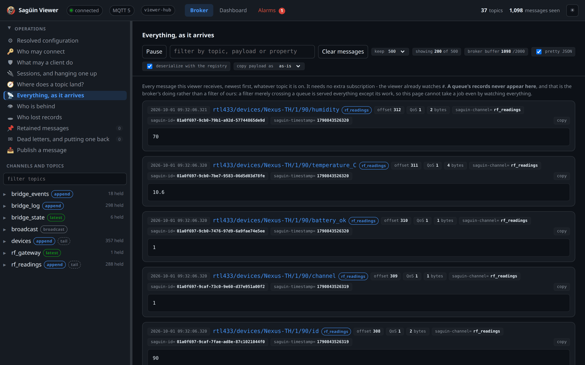
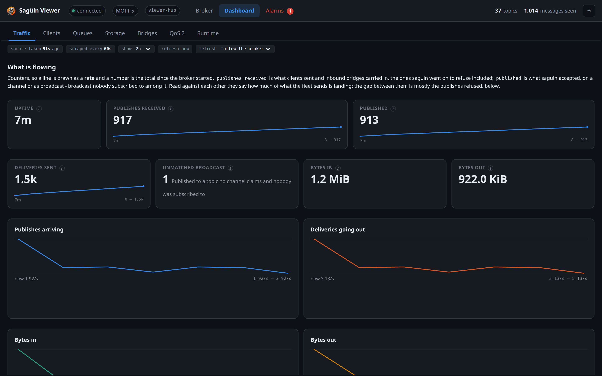

# Home automation on Sagüin, with no radio hardware

Two real gateways, both stock images with no patches, talking to Sagüin
as their broker: zigbee2mqtt for the Zigbee devices and rtl_433 for the
433MHz ones. Neither knows the other exists, and both gain durability they
did not ask for.

```sh
docker compose up -d --build
```

That is the whole of it. Open the viewer at **<http://localhost:4001>** and
watch the readings arrive.


This is what the viewer shows a few minutes in: readings from the 433MHz
sensors arriving through `rf_readings`, each with its channel and offset, and
Sagüin's own numbers beside them.





**Run this demo or the connectors one, not both at once.** Both publish
`1883`, because both want the port an MQTT client reaches without being
told. Stop the other first with `docker compose down` in its directory.
Brought up on top of each other, the second does not refuse cleanly: its
broker starts *healthy with no published ports*, and `localhost:1883` keeps
answering - from the first demo's broker. Everything then measures the wrong
one.

**The viewer needs a second checkout**, because it is not in this
repository: clone [saguin-viewer](https://github.com/ifnesi/saguin-viewer)
beside saguin, which is where `docker-compose.yml` looks, or export
`SAGUIN_VIEWER_DIR` pointing at it anywhere else.

    git clone https://github.com/ifnesi/saguin-viewer.git ../../../saguin-viewer

| | |
|---|---|
| **The viewer**, <http://localhost:4001> | every topic as a tree, a live feed, a replay control, a publish form, and Sagüin's own numbers |
| Sagüin | MQTT 5, authenticated, `localhost:1883` |
| Sagüin operations | `/health` and `/metrics`, `localhost:9091`, `operator:operator-password-change-me` |
| zigbee2mqtt | the stock `koenkk/zigbee2mqtt` image, no patches |
| rtl_433 | the stock `hertzg/rtl_433` image, no patches |
| coordinator | an emulated Zigbee radio and the devices behind it |
| transmitter | an emulated 433MHz dongle and the sensors on the air |

## How it fits together

```mermaid
flowchart LR
    subgraph zradio["coordinator, an emulated Zigbee radio"]
        direction TB
        D1["living-room-sensor<br/>temperature, humidity, battery"]
        D2["bedroom-sensor"]
        D3["kitchen-plug<br/>on / off"]
    end

    subgraph rradio["transmitter, an emulated 433MHz dongle"]
        direction TB
        R1["garden<br/>temperature, humidity"]
        R2["garage"]
        R3["loft"]
    end

    Z["zigbee2mqtt<br/>stock image, unmodified"]
    R["rtl_433<br/>stock image, unmodified"]
    S["saguin<br/>MQTT 5, authenticated"]
    V["viewer :4001"]

    zradio -- "ZCL over TCP<br/>attribute reports, announcements" --> Z
    rradio -- "OOK samples over rtl_tcp<br/>433.92 MHz" --> R
    Z -- "publishes as zigbee2mqtt-hub-1" --> S
    R -- "publishes as rtl433-hub-1" --> S
    S --> V
    V -- "zigbee2mqtt/kitchen-plug/set<br/>as viewer-hub" --> S
    S --> Z
    Z -- "ZCL command" --> zradio

    subgraph chans["saguin channels"]
        direction TB
        C1["<b>append</b> · devices<br/>zigbee2mqtt/+"]
        C2["<b>latest</b> · bridge_state<br/>zigbee2mqtt/bridge/+"]
        C4["<b>append</b> · rf_readings<br/>rtl433/devices/+/+/+/+"]
        C5["<b>latest</b> · rf_gateway<br/>rtl433/availability"]
        C3["<b>broadcast</b> · not a channel<br/>.../set, rtl433/events"]
    end
    S -.-> chans
```



Solid lines carry data; the dotted line is what Sagüin does with it. **Only
the two gateways publish to Sagüin.** A Zigbee reading starts as a ZCL frame
from an emulated device, and a 433MHz reading starts as actual radio: the
sensors are modulated into samples and rtl_433 demodulates and decodes them
with no idea anything is emulated.

The return path exists on one side only, and that is the protocols talking
rather than a gap in the demo. The viewer publishes a command to a topic no
channel claims, zigbee2mqtt turns it into a ZCL command, and the device's new
state comes back the way every other reading does. **A 433MHz sensor has no
receiver**: it announces every half minute and cannot be addressed, which is
exactly what you get for a device costing a few pounds and running two years
on a pair of AAs.

**Neither gateway can write the other's topics.** They have their own
credentials, their own roles and their own channels, and `smoke.sh` checks
both directions: a stolen radio credential cannot invent a Zigbee reading,
and the Zigbee bridge cannot invent a temperature in the garden.

## What is real and what is not

Being clear about this is the point; a demo that blurs it is worth nothing.

**Real: both gateways**, as their published images. zigbee2mqtt's MQTT
client, its session, its bridge topics and its reconnection; rtl_433's
demodulator, its decoders and its MQTT output. Each authenticates to Sagüin
with a user name and a password, and each is configured exactly as it would
be against any broker.

**Emulated: the two radios.** `coordinator/` answers on a TCP socket where a
Zigbee coordinator would, presenting one that is already commissioned.
`transmitter/` answers where an rtl_tcp server would, which is how people put
an SDR dongle on the network. Neither gateway can tell.

**Emulated too: the devices.** The Zigbee ones live behind the coordinator
and speak ZCL. The 433MHz ones are further from the pretence than that:
`transmitter/` modulates them into on-off keying at 250,000 samples a second
and rtl_433 demodulates the result, so what crosses that socket is radio
rather than readings. Nothing in either emulator links an MQTT library.

**Nothing but the two gateways publishes to Sagüin.** Every device topic in
the tree got there because a real gateway decoded something a radio said.

## Both radios are swappable back ends

zigbee2mqtt talks to its radio over a serial port **or a TCP socket**, and
rtl_433 takes its samples from a USB dongle **or an rtl_tcp server**. Both of
those exist so people can put the radio on the network. So neither emulator
is a fake standing in for the real thing: each is one of two things that
answer the same socket.

```yaml
# zigbee2mqtt.yaml
serial:
  port: tcp://coordinator:8888    # this demo
  # port: tcp://198.51.100.50:6638 # an SLZB-06, a flashed Sonoff ZBBridge,
                                  # or any USB stick behind ser2net
  adapter: zstack
```

```yaml
# docker-compose.yml, the rtl433 service
- "-d"
- "rtl_tcp://transmitter:1234"   # this demo
# - "rtl_tcp://198.51.100.60:1234"  # a Raspberry Pi running rtl_tcp
# - "driver=rtlsdr"                # a dongle in this machine's USB port
```

One address changes and nothing else does: not Sagüin's configuration, not
the channels, not the viewer.

**A consumer hub is not this.** Hue, Aqara and Tuya bridges run their own
closed stack and never expose the radio. Only a coordinator-over-IP works.

## What Sagüin adds

Six channels, in `saguin.yaml`, and each is an answer to something a plain
broker cannot do.

**`devices`** keeps every device reading and replays it from a stored
position. Plain MQTT hands a reading to whoever is subscribed at that instant
and then forgets it: close a dashboard for the weekend and the weekend did not
happen. Here the readings are on disk, and a client that was away resumes
where it left off, so *what was the bedroom doing at four this morning* is a
question the broker can answer.

That is `append`, and three devices reporting every ten seconds is around
twenty-six thousand records a day, which is why the channel carries retention.

**It also carries `start: tail`, which is what makes it pleasant to read.**
That setting governs only a subscriber with *no stored position*: a dashboard
opening for the first time is handed live readings rather than a week of
history it never asked for. A client that was here before and kept its session
is untouched by it, since it resumes at its own position and is served
everything it missed, which is the whole durability claim. And the history is
still reachable: a seek to `0` is everything the channel holds, and a seek
needs a durable session, so a reader that wants the tail by default and
history on demand simply keeps its session.

`floor`, the default, is the right answer for a channel of events nobody may
miss. This is a channel of readings, where the newest is what a dashboard
wants and the rest is there when it asks. `smoke.sh` checks both halves: that
a first-time reader is not handed the backlog, and that a returning session
is served what it missed.

**`bridge_state`** is the contrast: a `latest` channel, holding the current
value of each of the bridge's own topics and nothing older. A dashboard that
reconnects learns what the bridge is in one message rather than by reading a
history it does not want.

**`bridge_log`** keeps the hub's log and replays it from a stored position.
"What was the hub saying at four this morning" is the question a home user has
after something went wrong overnight, and plain MQTT answers it only for
whoever happened to be subscribed at the time.

**`bridge_events`** holds what the network did: every `device_announce` as
each device makes itself known, and on real hardware the joins, leaves and
interviews too. These are zigbee2mqtt's own events, published because
something happened on the radio. Subscribe to it and the announcements
replay from the beginning.

**`rf_readings`** is the radio half's answer to the same question as
`devices`, and it is `append` for the same reason: a garden thermometer is
worth having a history of. rtl_433 publishes one topic per field rather than
one document per reading, so a single transmission arrives as a handful of
records under `rtl433/devices/<model>/<channel>/<id>/<field>`, and the
channel's filter names the four levels that vary.

**`rf_gateway`** is `latest`, holding whether the radio gateway is up. It is
worth knowing how that arrives: rtl_433 connects with a **retained Will** on
that topic, so a broker with no retained store must refuse the connection
outright. Sagüin does, with `0x9A` and a reason naming the topic, which is a
better morning than wondering why a gateway will not connect.

**And what is deliberately not a channel:** `zigbee2mqtt/<device>/set`, and
`rtl433/events`. A command is not state: `devices` claims `zigbee2mqtt/+`,
which is one level, so it takes `zigbee2mqtt/kitchen-plug` and leaves
`zigbee2mqtt/kitchen-plug/set` as ordinary broadcast, and a fresh subscriber
is never handed a stale command as though it were current. `rtl433/events` is
every reading a second time as one JSON document, which is useful to watch
live and pointless to store beside the same readings in `rf_readings`.

## Identity: a password is not enough

`acl.yaml` gives roles to principals, and every credential is bound to a
client id: its own name, except the RF bridge's, which is bound to a
pattern:

```yaml
zigbee2mqtt-hub-1:
  roles: [zigbee-bridge]
  client_ids: "%u"
```

A hub's password ends up in a compose file, a backup and somebody's notes.
Bound this way, a copy of it used from any other client id is refused, and
`smoke.sh` checks exactly that, because nothing else here would notice if the
line were dropped.

The roles are what you would expect and the separation is the point: the
bridge writes device state and no dashboard can, so a buggy dashboard cannot
invent a temperature every other client then believes. A dashboard writing a
device topic gets `0x87 Not authorized`; the same client writing the command
topic is allowed.

**Every credential in this directory is a placeholder ending in
`-change-me`.** They are checked in so the demo runs from a clean clone, and
they are readable, and they are not a starting point for anything real:
demo credentials, public; change them before exposing a broker.

Changing one is `saguin --passwd add <file> <user> <password>` against the file
here, followed by `docker compose down` and `up -d` rather than a restart. Two
things bite otherwise.

`--passwd` writes the file `0600`, which is right for a real password file
and wrong here: the broker runs in the container as uid 10001 while these
files are owned by you, so it needs to stay readable by others. That is what
a checkout leaves it and what `--passwd` takes away. Git records only whether
a file is executable, so the exact bits come from your umask; other-readable
is the part that matters, and the mode is read when the container is
**created**, not when it starts.

And a bind-mounted file is pinned to the inode it had when the container was
created, while `--passwd` replaces the file rather than editing it. So a
running container goes on reading the old one: `ls -l` inside it shows the
old mode and contents, and a `SIGUSR1` re-read reports the old user count.
`docker compose down` and `up -d` is what makes a replaced file visible; a
restart is not.

## No TLS here, and the block to uncomment

This runs in plain text. A self-signed certificate would mean telling every
client to skip verification, which looks secured and is not, so instead both
`saguin.yaml` and `zigbee2mqtt.yaml` carry the full TLS block, commented, with
what each field is for. Uncomment both, move Sagüin to 8883, change
zigbee2mqtt's `server` to `mqtts://`, and point `ca` at the authority that
signed the broker's certificate.

Mutual TLS is written out too. With it, the certificate's name - its Common
Name, or its first DNS name where it has none - becomes the user name,
`acl.yaml` matches it the same way, and no password is needed at all.

## Edge and DDIL

One honest note. **zigbee2mqtt has no session-durability setting**: its MQTT
options are the ones in its schema and none of them is clean-start or session
expiry. So on a link that comes and goes, what survives is not the client's
session: it is Sagüin's channels, on disk, in sqlite. That is the whole of the
argument, and it is why storage here is `sqlite` and not `memory`, because a
memory-backed channel survives a graceful shutdown and nothing else, which on
a hub that loses power is no survival at all.

## Checking it, which is optional

Running the demo needs nothing but the command above. `./smoke.sh` is there
for when you want the demo to prove itself rather than look right. It asks
thirty-two yes/no questions and prints pass or fail for each.

It is worth running because a stack can look entirely healthy while being
wrong: every container can report healthy, zigbee2mqtt publish and the
viewer show a full topic tree, while `devices` is declared the wrong kind of
channel and hands back every historical reading instead of the current one.
Only the script disagrees.

It asks the things a gateway structurally cannot answer, because both
gateways have the right password and the permissions they need: is a wrong
password refused, is a borrowed client id refused, is a dashboard stopped
from writing a device topic, **can either gateway write the other's topics**,
is the command topic left unstored, does state survive a restart, **do the
sessions survive it too** - the broker says how many it put back, and the
session a dashboard left is still its own afterwards - and does a command
actually reach a device and come back.

It counts its own checks and fails if the number that ran is not the number
defined, because a check lost to a typo shortens a sweep silently.

It takes **three to four minutes**, measured at 223 seconds here, which is
not it hanging. Both device channels carry `start: tail`, so a reader with no
stored position is served live traffic rather than a backlog, and several
checks therefore have to wait for a device to transmit instead of draining
history in a second. The radio half is the slower of the two: a 433MHz sensor
announces every half minute, as a battery-powered one must, so the check that
proves all three are heard waits long enough to hear all three. That is the
cost of checking what a channel actually does rather than what it holds.

It needs `mosquitto_pub` and `mosquitto_sub` on your machine, which is the one
thing in this demo that is not in a container.

## Poking at it

```sh
docker compose logs -f zigbee2mqtt      # the Zigbee bridge
docker compose logs -f rtl433           # every reading that came off the air
docker compose logs -f coordinator      # what the Zigbee radio answered
docker compose logs -f transmitter      # every burst the 433MHz radio sent
docker compose exec saguin sh           # a shell, on purpose
docker compose down -v                  # and forget everything
```

**The broker's database is on a named volume, so it outlives a rebuild** - and
a broker built with a newer storage schema refuses a volume an older one
wrote, naming both versions, and the container restarts on that refusal.
Reset the volume with `docker compose down -v`, or first export it with
`saguin --sqlite-to-snapshots` on the older image.

The two logs worth putting side by side are `transmitter` and `rtl433`: one
says what was transmitted, the other says what a real decoder made of it. A
reading that appears in the first and not the second is a decode that did not
happen, which is the honest failure mode of radio and the reason this demo
sends samples rather than readings.

The coordinator logs every request it could not answer. If a future
zigbee2mqtt asks for something new, that log names it.
